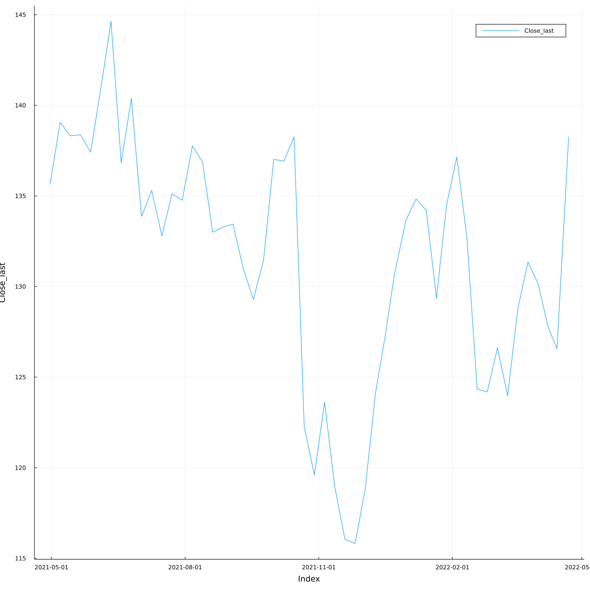

# TSx

[](https://xKDR.github.io/TSx.jl/stable)
[](https://xKDR.github.io/TSx.jl/dev)


TSx is a Julia package to handle timeseries data. It provides a
convenient interface for the commonly used timeseries data
manipulations. TSx is built on top of the powerful and mature
[DataFrames.jl](https://github.com/JuliaData/DataFrames.jl) making
use of the many capabilities of the `DataFrame` type and being easily
extensible at the same time.

## Installing TSx

```julia
julia> using Pkg
julia> Pkg.add(url="https://github.com/xKDR/TSx.jl")
```

## Basic usage

### Creating TS objects
```julia
julia> using CSV, Dates, DataFrames, TSx

julia> ts = CSV.File("IBM.csv") |> DataFrame |> TS
(252 x 6) TS with Dates.Date Index

 Index       Open     High     Low      Close    Adj Close  Volume
 Date        Float64  Float64  Float64  Float64  Float64    Int64
─────────────────────────────────────────────────────────────────────
 2021-04-26  136.157  137.314  135.258  135.344    129.028   4927497
 2021-04-27  135.459  136.291  134.56   135.765    129.429   4062664
 2021-04-28  136.635  137.094  135.851  136.711    130.332   3941433
 2021-04-29  137.792  142.199  136.692  137.897    131.462   4554179
 2021-04-30  137.38   137.505  134.369  135.641    129.311   9280321
 2021-05-03  137.486  139.34   137.237  138.384    131.927   5997241
 2021-05-04  138.059  140.143  137.983  139.34     132.838   6642623
 2021-05-05  139.522  139.522  138.595  138.834    132.355   5229895
 2021-05-06  138.872  141.979  138.795  141.893    135.272   7848661
 2021-05-07  139.503  139.713  138.212  139.063    134.055   7325661
     ⋮          ⋮        ⋮        ⋮        ⋮         ⋮         ⋮
 2022-04-11  127.95   128.18   126.18   126.37     126.37    3202500
 2022-04-12  126.42   127.34   125.58   125.98     125.98    2691000
 2022-04-13  125.64   126.67   124.91   126.14     126.14    3064900
 2022-04-14  128.93   130.58   126.38   126.56     126.56    6382800
 2022-04-18  126.6    127.39   125.53   126.17     126.17    4884200
 2022-04-19  126.08   129.4    126.0    129.15     129.15    7971400
 2022-04-20  135.0    139.56   133.38   138.32     138.32   17859200
 2022-04-21  138.23   141.88   137.35   139.85     139.85    9922300
 2022-04-22  139.7    140.44   137.35   138.25     138.25    6505500
                                                     233 rows omitted
```

### Indexing
```julia
julia> ts[1:10, :Close]
(10 x 1) TS with Dates.Date Index

 Index       Close
 Date        Float64
─────────────────────
 2021-04-26  135.344
 2021-04-27  135.765
 2021-04-28  136.711
 2021-04-29  137.897
 2021-04-30  135.641
 2021-05-03  138.384
 2021-05-04  139.34
 2021-05-05  138.834
 2021-05-06  141.893
 2021-05-07  139.063

```

### Subsetting
```julia
julia> from = Date(2021, 04); to = Date(2021, 06);

julia> TSx.subset(ts, from, to)
(26 x 6) TS with Date Index

 Index       Open     High     Low      Close    Adj Close  Volume  
 Date        Float64  Float64  Float64  Float64  Float64    Int64   
────────────────────────────────────────────────────────────────────
 2021-04-26  136.157  137.314  135.258  135.344    129.028  4927497
 2021-04-27  135.459  136.291  134.56   135.765    129.429  4062664
 2021-04-28  136.635  137.094  135.851  136.711    130.332  3941433
     ⋮          ⋮        ⋮        ⋮        ⋮         ⋮         ⋮
 2021-05-28  137.868  137.983  137.18   137.419    132.47   2651192
 2021-06-01  138.623  139.417  137.428  137.849    132.885  2528705
                                                     21 rows omitted
```

### Frequency conversion
```julia
julia> ts_weekly = apply(ts, Week, last, last)
(52 x 6) TS with Date Index

 Index       Open_last  High_last  Low_last  Close_last  Adj Close_last  Volume_last 
 Date        Float64    Float64    Float64   Float64     Float64         Int64       
─────────────────────────────────────────────────────────────────────────────────────
 2021-04-30    137.38     137.505   134.369     135.641         129.311      9280321
 2021-05-07    139.503    139.713   138.212     139.063         134.055      7325661
 2021-05-14    138.728    139.283   137.629     138.317         133.336      2873780
     ⋮           ⋮          ⋮         ⋮          ⋮             ⋮              ⋮
 2022-04-14    128.93     130.58    126.38      126.56          126.56       6382800
 2022-04-22    139.7      140.44    137.35      138.25          138.25       6505500
                                                                      47 rows omitted
```

### Plotting
```julia
julia> using Plots
julia> plot(ts_weekly_closing)
```



## Documentation

Head to the TSx [user guide](https://xkdr.github.io/TSx.jl/dev/user_guide/) for more
examples and functionality. The API reference is available on the
[documentation](https://xkdr.github.io/TSx.jl/dev/api/) page.

## Contributions

All or any contributions are welcome, small or large. Please feel free
to fork the repository and submit a Pull Request.
